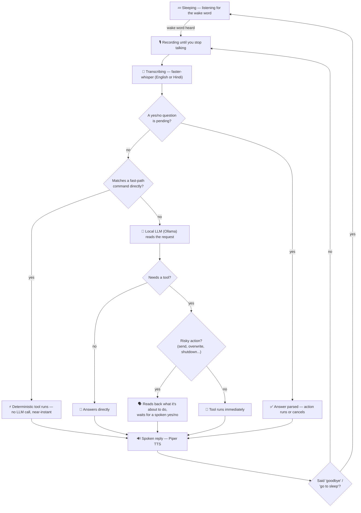

# Raziel — a local, offline voice assistant

<p align="center">
  
  
  
  
  
  
</p>

Say the wake word, then just talk. Raziel listens continuously, understands
English and Hindi, calls real tools instead of just describing what it would
do, and keeps a running conversation until you say "goodbye" or "go to
sleep". Everything - wake word detection, speech recognition, the language
model, and text-to-speech - runs locally. No subscription, no account
required for the core experience, and nothing risky (sending a message,
overwriting a file, shutting the PC down) ever runs without you saying yes
first.

## Table of contents

- [Features](#features)
- [Workflow](#workflow)
- [Prerequisites](#prerequisites)
- [Quick start](#quick-start)
- [Optional add-ons](#optional-add-ons)
- [Running it](#running-it)
- [Example commands](#example-commands)
- [Tuning](#tuning)
- [Adding more apps](#adding-more-apps)
- [Project docs](#project-docs)
- [Troubleshooting](#troubleshooting)

## Features

| | |
|---|---|
| 🗣️ **Wake word → conversation** | A custom wake word trained on your own voice (or any openWakeWord built-in), then a real back-and-forth with no need to repeat it between turns |
| 🧠 **Local LLM brain** | Ollama (`qwen3:8b` by default) calls real tools instead of just talking about doing them |
| 🌐 **Bilingual** | Understands and speaks English and Hindi, switching per sentence |
| 📂 **Apps, files & the web** | Opens apps/files/folders by name, searches the web or a site, takes and describes screenshots, reads what's on your screen |
| 💬 **Messaging** | WhatsApp messages and email drafts — nothing sends without you confirming first |
| 🎵 **Music** | Full Spotify playback control by voice (requires Premium) |
| 🧾 **Memory** | Remembers facts and conversations across restarts, via a local database |
| ⏰ **Timers & reminders** | Fire even while it's back asleep |
| 🖥️ **PC control** | Volume, brightness, lock, sleep, close app, shutdown/restart — destructive ones always ask first |
| 📅 **Calendar & mail** | Reads Google Calendar and Gmail (read-only), adds events with confirmation |
| ☀️ **Daily extras** | Morning briefing, calculator, unit/currency conversion, dictation, notes/lists, clipboard read-aloud |
| 🧍 **3D avatar** *(optional)* | A VRM face with lip sync and expression in its own always-on-top window |
| 📱 **Phone bridge** *(optional)* | Talk to Raziel from your Android phone from anywhere, and have it ring/text/open an app on your phone in return |

Every action that can't be undone is read back to you out loud and only runs after you say yes.

## Workflow

What happens between hearing the wake word and hearing a reply:



Two things keep it fast and safe:

- **Fast path first.** Common phrases ("open notepad", "what time is it",
  "pause the music") are matched in code before the LLM is even asked —
  that's the difference between an instant reply and waiting on a model
  inference every single time.
- **Confirm before anything irreversible.** Sending a message, overwriting
  a file, or shutting the PC down always gets read back to you first; it
  only runs on a clear "yes", and silence, "no", or an unclear answer
  cancels it.

## Prerequisites

- Windows 10/11
- Python 3.11 or 3.12 (not 3.13 yet — some audio libs lag behind new releases)
- A working microphone and speaker
- No account or API key needed for the core experience — wake word
  (openWakeWord), speech recognition (faster-whisper), the LLM brain
  (Ollama), and text-to-speech (Piper) all run fully offline and free
- [Ollama](https://ollama.com/download) installed
- 8GB+ RAM recommended (more with a GPU) for the default `qwen3:8b` model —
  see [Tuning](#tuning) for a lighter option

## Quick start

**1. Install dependencies**

```powershell
python -m venv venv
venv\Scripts\activate
pip install -r requirements.txt
```

<details>
<summary><code>pyaudio</code> failed to install?</summary>

```powershell
pip install pipwin
pipwin install pyaudio
```
</details>

**2. Set up your config**

```powershell
copy config.example.py config.py
```

`config.py` is where every setting lives, and it's excluded from git on
purpose since it ends up holding your own API keys and contacts. Everything
inside is commented — most sections (Spotify, Google, the phone bridge) are
entirely optional.

**3. Download the wake word model files (one-time)**

```powershell
python -c "import openwakeword; openwakeword.utils.download_models()"
```

Downloads a small set of `.onnx` files (a few MB total), cached locally. By
default `config.py` points at a custom-trained `Raziel.onnx` with a
fallback to `hey_jarvis`; if you haven't trained your own, just set
`WAKE_WORD_MODEL = "hey_jarvis"`.

**4. Set up Ollama**

```powershell
ollama pull qwen3:8b
ollama run qwen3:8b "say hello in 5 words"
```

If that replies, Ollama is ready.

**5. Download the voice (Piper — free, local, neural TTS)**

```powershell
python -m piper.download_voices en_GB-cori-high
```

To try a different voice, browse [Piper's voice list](https://github.com/rhasspy/piper/blob/master/VOICES.md),
change `PIPER_VOICE_NAME` in `config.py`, then re-run the command with the
new name. If Hindi is enabled (`HINDI_ENABLED = True`, on by default), the
Hindi voice downloads automatically the first time it's needed.

You're set — jump to [Running it](#running-it).

## Optional add-ons

<details>
<summary><b>Spotify playback</b> — requires Spotify Premium</summary>

1. Go to https://developer.spotify.com/dashboard and log in
2. Click **Create app**
3. For **Redirect URI**, enter exactly: `http://127.0.0.1:8888/callback`
   (Spotify requires the literal IP, not `localhost`)
4. Copy the **Client ID** and **Client Secret** into `config.py`:
   ```python
   SPOTIFY_CLIENT_ID = "your-client-id-here"
   SPOTIFY_CLIENT_SECRET = "your-client-secret-here"
   ```
5. The first time you ask it to play music, a browser window opens for you
   to authorize the app — approve it once, and it's remembered from then on
6. Make sure you're logged into the **same Spotify account** in the desktop
   app that you used to create the developer app

Skip this and `play_music` just says it isn't set up yet — everything else
works fine.
</details>

<details>
<summary><b>Google Calendar + Gmail</b> — read-only mail, opt-in calendar events</summary>

See `SETUP_V3.md` for the full walkthrough, then run:

```powershell
python google_setup.py
```

and sign in in the browser. Nothing is ever sent or deleted: it reads mail
and adds calendar events only after you say yes.
</details>

<details>
<summary><b>3D avatar</b> — a VRM face with lip sync</summary>

```powershell
pip install pywebview websockets
```

Set `AVATAR_ENABLED = True` in `config.py` (on by default) and place a VRM
model file where `AVATAR_MODEL_PATH` points.
</details>

<details>
<summary><b>Phone bridge</b> — control it from, and be reached on, your phone</summary>

Full setup (Tailscale + Tasker + Join, ~15 minutes, mostly free) is in
`PHONE_BRIDGE_SETUP.md`.
</details>

## Running it

```powershell
venv\Scripts\activate
python main.py
```

Say your wake word (**"Raziel"** by default, or **"Hey Jarvis"** if you
haven't trained a custom model). It'll say it's listening — now just talk
normally, no need to repeat the wake word between turns. Say **"goodbye"**
or **"go to sleep"** (also understood in Hindi) when you're done.

Press `Ctrl+C` to stop.

## Example commands

| Say this | It does this |
|---|---|
| "What's the capital of Japan?" | Answers directly, no tool needed |
| "Open notepad" / "Open my resume.pdf" | Opens the app or file by name |
| "Open Google and search for the weather in Tokyo" | Opens the site with the search already run |
| "Send a WhatsApp message to [contact] saying I'll be late" | Reads the message back, sends only on "yes" (needs `CONTACTS` in `config.py`) |
| "Play Blinding Lights by The Weeknd" | Plays it via Spotify (needs Spotify setup) |
| "Remember that I have an exam on Friday" | Saves it — ask "what do you remember about my exam?" later, or "forget about the exam" |
| "Set a timer for 10 minutes" / "Remind me to call Mom at 6pm" | Fires even if it's gone back to sleep |
| "What's on my calendar today?" / "Do I have any new email?" | Reads from Google Calendar / Gmail (read-only) |
| "Turn the volume up" / "Lock my PC" | Direct PC control |
| "What's on my screen?" | Describes it with a local vision model |
| "Start typing" | Dictation mode |
| Ask it in Hindi | Answers in Hindi |

## Tuning

All settings live in `config.py`, each one commented in place. The most
useful ones to know about:

| Setting | What it does |
|---|---|
| `WAKE_WORD_MODEL` / `WAKE_WORD_THRESHOLD` | Swap the wake word or adjust sensitivity — lower if it's not triggering, raise if it triggers randomly |
| `SILENCE_RMS_THRESHOLD` | Lower if it cuts you off mid-sentence, raise if it never stops recording in a noisy room. Run `python mic_test.py` to measure your real mic levels |
| `WHISPER_MODEL_SIZE` | `tiny`/`base` = faster, less accurate. `small`/`medium` = slower, more accurate |
| `OLLAMA_MODEL` | `qwen3:8b` by default; try `llama3.2` (`ollama pull llama3.2` first) if it's too slow on your machine |
| `HINDI_ENABLED` | Set `False` for English-only |
| `CONFIRM_RISKY_ACTIONS` / `CONFIRM_ACTIONS` | Which actions ask for a spoken yes/no before running |

## Adding more apps

`open_app` already searches Start Menu shortcuts (covering almost anything
installed) with website fallbacks for a few common ones. For anything it
still can't find, add it to the `APP_COMMANDS` dictionary at the top of
`tools.py`:

```python
"discord": "discord.exe",
```

## Project docs

| Doc | Covers |
|---|---|
| [`PROJECT.md`](PROJECT.md) | The full development log and feature history |
| [`SETUP_V3.md`](SETUP_V3.md) | Setup for Hindi / Google knowledge / PC-control features |
| [`PHONE_BRIDGE_SETUP.md`](PHONE_BRIDGE_SETUP.md) | Setup for talking to Raziel from your phone |
| [`HANDOFF.md`](HANDOFF.md) | Internal notes on the codebase's structure and safety rules |

## Troubleshooting

<details>
<summary>No sound on playback</summary>

Check Windows' default output device — Piper's audio plays through
whatever the default output is.
</details>

<details>
<summary>"No module named 'piper'" or voice file not found</summary>

Make sure you ran the download command from this exact project folder,
since `PIPER_MODEL_PATH` looks for the `.onnx` file right next to the
scripts.
</details>

<details>
<summary>First run is slow</summary>

openWakeWord, faster-whisper, and the Ollama model all download files the
first time they're used — cached after that.
</details>

<details>
<summary>Wake word never triggers</summary>

Lower `WAKE_WORD_THRESHOLD` in `config.py`, or double-check the model files
downloaded successfully.
</details>

<details>
<summary>Wake word triggers randomly</summary>

Raise `WAKE_WORD_THRESHOLD`, or reduce background noise/TV/music near the mic.
</details>

<details>
<summary>It mishears you constantly</summary>

Run `python mic_test.py` to check your actual mic levels. Also check
Windows Sound settings for Microphone Boost set too high, which can make
background noise look like speech.
</details>

<details>
<summary>"I'm having trouble reaching my local brain"</summary>

Ollama isn't running. Confirm it's installed and try
`ollama run qwen3:8b "hi"` in a terminal to check it responds.
</details>

<details>
<summary>Tool calls don't work reliably</summary>

Confirm `OLLAMA_ENABLE_THINKING = False` in `config.py` (thinking mode can
interfere with clean tool-call output), and that you're running the full
`qwen3:8b` model, not a smaller quantized variant.
</details>

<details>
<summary>Web search fails</summary>

`ddgs` (DuckDuckGo search) doesn't need a key, but can occasionally
rate-limit — wait a bit and try again.
</details>
