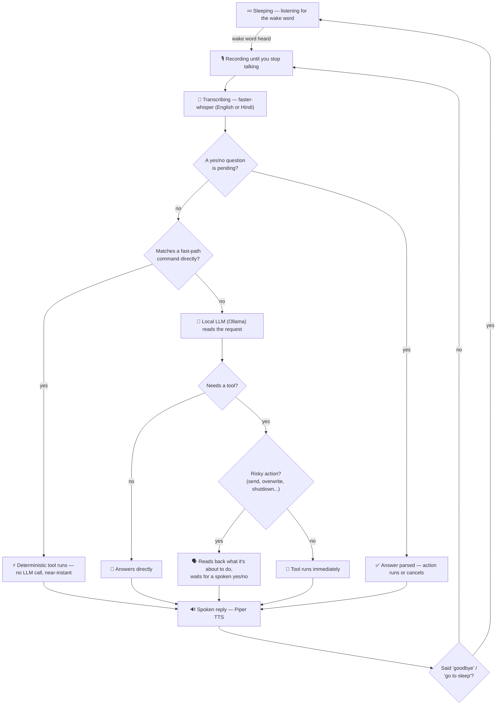

# Raziel — a local, offline voice assistant

<p align="center">
  
  
  
  
  
  
</p>

Say the wake word, then just talk. Raziel listens continuously, understands
English and Hindi, calls real tools instead of just describing what it would
do, and keeps a running conversation until you say "goodbye" or "go to
sleep". Everything - wake word detection, speech recognition, the language
model, and text-to-speech - runs locally. No subscription, no account
required for the core experience, and nothing risky (sending a message,
overwriting a file, shutting the PC down) ever runs without you saying yes
first.

## Table of contents

- [Features](#features)
- [Workflow](#workflow)
- [Prerequisites](#prerequisites)
- [Quick start](#quick-start)
- [Optional add-ons](#optional-add-ons)
- [Running it](#running-it)
- [Example commands](#example-commands)
- [Tuning](#tuning)
- [Adding more apps](#adding-more-apps)
- [Project docs](#project-docs)
- [Troubleshooting](#troubleshooting)

## Features

| | |
|---|---|
| 🗣️ **Wake word → conversation** | A custom wake word trained on your own voice (or any openWakeWord built-in), then a real back-and-forth with no need to repeat it between turns |
| 🚀 **Always listening** | Starts by itself in the background when you log in to Windows — no command prompt, just say "Raziel" |
| 🧠 **Local LLM brain** | Ollama (`qwen3:8b` by default) calls real tools instead of just talking about doing them |
| 🌐 **Bilingual** | Understands and speaks English and Hindi, switching per sentence |
| 📂 **Apps, files & the web** | Opens apps/files/folders by name, searches the web or a site, takes and describes screenshots, reads what's on your screen |
| 💬 **Messaging** | WhatsApp messages and email drafts — nothing sends without you confirming first |
| 🎵 **Music** | Full Spotify playback control by voice (requires Premium). While music plays she waits for her name, then turns the music down while she listens and answers |
| 🧾 **Memory** | Remembers facts and conversations across restarts, via a local database |
| ⏰ **Timers & reminders** | Fire even while it's back asleep |
| 🖥️ **PC control** | Volume, brightness, lock, sleep, close app, shutdown/restart — destructive ones always ask first |
| 📅 **Calendar & mail** | Reads Google Calendar and Gmail (read-only), adds events with confirmation |
| ☀️ **Daily extras** | Morning briefing, calculator, unit/currency conversion, dictation, notes/lists, clipboard read-aloud |
| 🔮 **Living orb avatar** | 24,000 glowing particles inside a glass crystal ball, always on top: pulses with her voice, glows with her mood, turns into a dragon, a sword, a knight, a butterfly, a planet, a heart or a galaxy when asked, and dances to music playing on your PC (the 3D VRM avatar is still one setting away) |
| 📱 **Phone bridge** *(optional)* | Talk to Raziel from your Android phone from anywhere, and have it ring/text/open an app on your phone in return |
| 🤖 **Hands-free AI chat** | "Open ChatGPT and ask ..." types the question, waits for the answer and reads it to you (a spoken summary when it's long; "read it all" for the rest) |
| 🔗 **Several commands at once** | "Open Spotify, play lo-fi and set the volume to 30": each part is done in order |
| 🔐 **Voice ID** | Risky actions (shutdown, messages, deleting...) only for your voice, so the TV or a guest can't trigger them; anyone can still ask the time or play music |
| 🃏 **Mini cards** | Under the orb: a live countdown for every timer, the Spotify song with its album art, today's weather during the briefing |
| 🎮 **Game & call mode** | Quiet by herself while a full-screen game runs or another app (Zoom, Discord, Teams...) uses the mic; timers pop up instead of being spoken |
| 🗂️ **Ask your own files** | "Find the PDF about the bank loan", "what does my resume say about Python?": Documents, Downloads and Desktop, searched by meaning, fully offline |
| 🌌 **Her universe** | Raziel is the Nexus at the centre of a small universe; six beings each look after one part of what she can do (music, messages, knowledge, the PC, time, security). Say a name first to call one; her window shows the galaxy map and flies into the being that is working |
| ✋ **Hand gestures** | Webcam gestures: palm to play / pause, swipes for songs, slides and volume, a fist turned like a knob for fine volume, thumbs up to like a song, pinch to move or resize her |

Every action that can't be undone is read back to you out loud and only runs after you say yes.

## Workflow

What happens between hearing the wake word and hearing a reply:


```mermaid
flowchart TD
    A["💤 Sleeping — listening for the wake word"] -->|wake word heard| B["🎙️ Recording until you stop talking"]
    B --> C["📝 Transcribing — faster-whisper (English or Hindi)"]
    C --> D{"A yes/no question<br/>is pending?"}
    D -- yes --> E["✅ Answer parsed — action runs or cancels"]
    D -- no --> F{"Matches a fast-path<br/>command directly?"}
    F -- yes --> G["⚡ Deterministic tool runs — no LLM call, near-instant"]
    F -- no --> H["🧠 Local LLM (Ollama) reads the request"]
    H --> I{"Needs a tool?"}
    I -- yes --> J{"Risky action?<br/>(send, overwrite, shutdown...)"}
    I -- no --> K["💬 Answers directly"]
    J -- yes --> L["🗣️ Reads back what it's about to do,<br/>waits for a spoken yes/no"]
    J -- no --> M["🔧 Tool runs immediately"]
    G --> N["🔊 Spoken reply — Piper TTS"]
    K --> N
    L --> N
    M --> N
    E --> N
    N --> O{"Said 'goodbye' /<br/>'go to sleep'?"}
    O -- no --> B
    O -- yes --> A
```

Two things keep it fast and safe:

- **Fast path first.** Common phrases ("open notepad", "what time is it",
  "pause the music") are matched in code before the LLM is even asked —
  that's the difference between an instant reply and waiting on a model
  inference every single time.
- **Confirm before anything irreversible.** Sending a message, overwriting
  a file, or shutting the PC down always gets read back to you first; it
  only runs on a clear "yes", and silence, "no", or an unclear answer
  cancels it.

## Prerequisites

- Windows 10/11
- Python 3.11 or 3.12 (not 3.13 yet — some audio libs lag behind new releases)
- A working microphone and speaker
- No account or API key needed for the core experience — wake word
  (openWakeWord), speech recognition (faster-whisper), the LLM brain
  (Ollama), and text-to-speech (Piper) all run fully offline and free
- [Ollama](https://ollama.com/download) installed
- 8GB+ RAM recommended (more with a GPU) for the default `qwen3:8b` model —
  see [Tuning](#tuning) for a lighter option

## Quick start

**1. Install dependencies**

```powershell
python -m venv venv
venv\Scripts\activate
pip install -r requirements.txt
```

<details>
<summary><code>pyaudio</code> failed to install?</summary>

```powershell
pip install pipwin
pipwin install pyaudio
```
</details>

**2. Set up your config**

```powershell
copy config.example.py config.py
```

`config.py` is where every setting lives, and it's excluded from git on
purpose since it ends up holding your own API keys and contacts. Everything
inside is commented — most sections (Spotify, Google, the phone bridge) are
entirely optional.

**3. Download the wake word model files (one-time)**

```powershell
python -c "import openwakeword; openwakeword.utils.download_models()"
```

Downloads a small set of `.onnx` files (a few MB total), cached locally. By
default `config.py` points at a custom-trained `Raziel.onnx` with a
fallback to `hey_jarvis`; if you haven't trained your own, just set
`WAKE_WORD_MODEL = "hey_jarvis"`.

**4. Set up Ollama**

```powershell
ollama pull qwen3:8b
ollama run qwen3:8b "say hello in 5 words"
```

If that replies, Ollama is ready.

**5. Download the voice (Piper — free, local, neural TTS)**

```powershell
python -m piper.download_voices en_GB-cori-high
```

To try a different voice, browse [Piper's voice list](https://github.com/rhasspy/piper/blob/master/VOICES.md),
change `PIPER_VOICE_NAME` in `config.py`, then re-run the command with the
new name. If Hindi is enabled (`HINDI_ENABLED = True`, on by default), the
Hindi voice downloads automatically the first time it's needed.

You're set — jump to [Running it](#running-it).

## Optional add-ons

<details>
<summary><b>Spotify playback</b> — requires Spotify Premium</summary>

1. Go to https://developer.spotify.com/dashboard and log in
2. Click **Create app**
3. For **Redirect URI**, enter exactly: `http://127.0.0.1:8888/callback`
   (Spotify requires the literal IP, not `localhost`)
4. Copy the **Client ID** and **Client Secret** into `config.py`:
   ```python
   SPOTIFY_CLIENT_ID = "your-client-id-here"
   SPOTIFY_CLIENT_SECRET = "your-client-secret-here"
   ```
5. The first time you ask it to play music, a browser window opens for you
   to authorize the app — approve it once, and it's remembered from then on
6. Make sure you're logged into the **same Spotify account** in the desktop
   app that you used to create the developer app

Skip this and `play_music` just says it isn't set up yet — everything else
works fine.
</details>

<details>
<summary><b>Google Calendar + Gmail</b> — read-only mail, opt-in calendar events</summary>

See `SETUP_V3.md` for the full walkthrough, then run:

```powershell
python google_setup.py
```

and sign in in the browser. Nothing is ever sent or deleted: it reads mail
and adds calendar events only after you say yes.
</details>

<details>
<summary><b>Orb avatar</b> — shapes on request, dancing to your music</summary>

On by default (`AVATAR_ENABLED = True`, `AVATAR_STYLE = "orb"` in `config.py`);
it needs `pywebview` and `websockets`, which are already in `requirements.txt`.
Nothing is downloaded from the internet: the page is self-contained.

To let her dance to whatever your PC plays (Spotify, YouTube, games...), install
one more package, once:

```powershell
venv\Scripts\pip install PyAudioWPatch
```

She listens to the speakers' output, not the microphone, and nothing is
recorded: each moment becomes 48 numbers that are thrown away. She tells a
song from someone talking (a podcast, a video) by how steadily it plays, and
her own voice never counts.
Calm songs make flowing waves, medium ones a spinning equalizer ring, and
hard-hitting ones a pulsing spiky sphere. Without the package everything else
works; she just doesn't dance.

| Setting | What it does |
|---|---|
| `AVATAR_STYLE` | `"orb"` (default) or `"vrm"` for the 3D character |
| `AVATAR_PARTICLES` | 24000 by default; fewer (e.g. 14000) = lighter on the CPU |
| `AVATAR_ORB_WINDOW_WIDTH` / `_HEIGHT` | Window size (420 × 560) |
| `AVATAR_TRANSPARENCY` | `"native"` = floats on your desktop; `"none"` = a dark tile with the full soft glow and stars |
| `AVATAR_ORB_LOOK` | On the desktop: `"sphere"` (default) = inside a glass crystal ball with the full glow; `"float"` = bare particles |
| `AVATAR_MUSIC_REACT` | Dance to music at all (or say "stop dancing" / "dance") |
| `AVATAR_MUSIC_GAIN_DB` | Raise if she barely reacts to quiet music |
| `AVATAR_REMEMBER_PLACE` | Reopen where you last dragged her, at the size you gave her (on by default) |
| `AVATAR_START_X` / `_Y` | Her spot when nothing is saved yet; `None` = the right-hand side of the main screen |

The see-through window can only show a pixel fully or not at all (soft edges would turn
red), so she lives inside a glass sphere: everything inside it is soft and glowing, and
only its round edge is sharp. The cards under her are rounded glass pills.

Drag her anywhere and hold **Ctrl** while turning the mouse wheel over her to make her
bigger or smaller: she opens there, at that size, next time (saved in `avatar_place.json`,
separately for the orb and the 3D avatar). If that screen is gone, she comes back onto
the nearest one.
</details>

<details>
<summary><b>New features setup</b> — AI answers, Voice ID, asking your own files</summary>

Run `install_new_features.bat` once (double-click it in the project folder), with
Ollama running. It:

1. installs `uiautomation` (to read ChatGPT / Gemini answers off the page) and `pypdf`
2. downloads the Voice ID model (26 MB) into `models\` and checks it
3. learns your voice from the recordings in `my_voice\` (the wake-word training clips)
4. pulls the small file-search model: `ollama pull nomic-embed-text` (about 270 MB)

Then restart Raziel ("Stop Raziel", then "Start Raziel"). Everything it writes goes
to `install_new_features.log`. Each feature works on its own: if a step fails, the
others still work, and that one feature simply stays off.

| Setting | What it does |
|---|---|
| `OWNER_NAME` | Your name, for "Sorry, I only do that for ..." |
| `VOICE_ID_THRESHOLD` / `VOICE_ID_REJECT_BELOW` | 0.45 / 0.33. Every check is in `assistant.log` as "Voice ID: 0.63 (...)". Lower the first a little (0.40) if she refuses you; raise it if a TV voice gets through |
| `VOICE_ID_GUARDED` | Which actions need your voice (see `voice_id.DEFAULT_GUARDED`) |
| `AI_CHAT_READ_FULL_WORDS` | Answers up to this many words are read in full, longer ones summarised |
| `QUIET_MIC_IGNORE` | Apps that use the mic but aren't calls (e.g. `("obs64.exe",)`), so they don't silence her |
| `CARDS_*` | Switch each mini card off |
| `FILE_INDEX_FOLDERS` / `FILE_INDEX_EXCLUDE` | Which folders are searched / skipped |
| `FILE_INDEX_EMBED_ON_CPU` | `True` keeps the graphics card for the chat model (slower first indexing) |
| `FILE_INDEX_MIN_SCORE` | How close a file must match (0.5); the scores are in `assistant.log` |

To learn your voice again (a new mic), delete `voice_profile.npz` and restart her.
`venv\Scripts\python.exe voice_id.py some.wav` prints how much a recording sounds like you.
</details>

<details>
<summary><b>Her universe</b> — six beings around the Nexus</summary>

| Being | Looks after | Try |
|---|---|---|
| **Raziel** (the Nexus, in the middle) | conversation, memory, routing everything | "Raziel, how are you?" |
| **Melody** | Spotify, YouTube, playlists, the queue | "Melody, play Kalyani" |
| **Hermes** | WhatsApp, Gmail, Calendar, your phone | "Hermes, message Fazal saying I'm on my way" |
| **Athena** | your files and notes, the web, ChatGPT / Gemini, study help | "Athena, explain virtual memory simply" |
| **Atlas** | apps, folders, typing, screenshots, the PC's controls | "Atlas, open my COA folder" |
| **Chronos** | reminders, timers, to-do lists, weather, news | "Chronos, remind me at 6 to call mum" |
| **Sentinel** | locking the PC, quiet mode, Voice ID, the phone link | "Sentinel, lock my laptop" |

Wake her with "Raziel" as always, then start with a name ("Melody, …" or "ask Athena …"). A named
being answers in its own style and knows which of her tools are its own. Say just the name ("Melody.")
and it answers ("Melody here."); your next sentence is for it. Without a name Raziel decides herself,
and the being whose work it was lights up on the map. (A sentence that only starts with the word -
"Atlas cycle price" - is not for a being: after the name comes a pause or a request.) Hindi works too:
"मेलोडी, गाना चलाओ".

Her window shows the universe: the Nexus star in the middle, one galaxy per being with its name and
symbol. When a being works, the camera flies into its galaxy (its symbol, name and helpers). "Show me
the universe" opens the map big for a while ("close the universe" ends it); "who lives in your
universe?" introduces them. Settings: `UNIVERSES_ENABLED`, `UNIVERSE_HOME` ("universe" or "orb" as her
resting look), `UNIVERSE_NAMES` to rename any being, `UNIVERSE_BIG_SECONDS`.
</details>

<details>
<summary><b>Hand gestures</b> — control music, slides and her window with your hands</summary>

Run `install_gestures.bat` once (it installs MediaPipe and OpenCV and downloads an 8 MB
hand model), then restart Raziel. She watches the webcam about 15 times a second; nothing
is recorded or saved, and the camera light shows whenever she watches.

| Gesture | What it does |
|---|---|
| Open palm, held up still for a second (a bar under her fills; drop your hand to cancel) | Play / pause (Spotify, YouTube, Netflix...) |
| Swipe right / left | Next / previous song, or next / previous slide or page when PowerPoint, a PDF or Google Slides is in front |
| Swipe up / down | Volume up / down; swipe down while she's talking skips ahead to the next part |
| A fist turned like a knob | Fine volume control (clockwise = louder) |
| Two fingers up, turned like a knob | Screen brightness |
| Thumbs up while a song plays | Adds it to your Spotify Liked Songs (Spotify asks for this permission once) |
| Pinch thumb and first finger (other fingers open, like an OK sign) and move | Drags her window |
| Pinch with both hands, pull apart / push together | Makes her bigger / smaller (remembered) |

Only a hand you **show** her counts: raised above desk level, upright, fingers pointing
up, and held still for a moment. Raise your open hand, pause for a moment (a fraction of a
second is enough), then swipe; swiping it right out of the picture counts too. Waving
while you talk or dropping your hand doesn't count. The knob needs a clear fist the hand
model recognises; its card appears with the first step you turn. She lets go of the camera during calls, while Zoom / Teams / Meet
or another camera app is in front, and while the PC is locked. Say "stop watching" to
turn the camera off (remembered) and "watch my hands" to turn it back on; "what gestures
do you know?" lists them. Run `check_gestures.bat` (with Raziel stopped) to see what she
sees. Each gesture group can be switched off with the `GESTURES_*` settings in `config.py`;
if music pauses by accident, raise `GESTURES_HOLD_SECONDS`. If your hand is ignored,
`check_gestures.bat` shows "COUNTS" or "ignored" (with why) next to it: lower
`GESTURES_RAISED`'s line or raise `GESTURES_UPRIGHT_DEGREES`. The hand points around every
gesture she acts on are kept in `gestures_debug.jsonl` (numbers only, no pictures), so a
gesture that fired by mistake can be looked into; `GESTURES_DEBUG_LOG = False` turns that off.
</details>

<details>
<summary><b>3D avatar</b> — a VRM face with lip sync</summary>

```powershell
pip install pywebview websockets
```

Set `AVATAR_STYLE = "vrm"` in `config.py` and place a VRM model file where
`AVATAR_MODEL_PATH` points.
</details>

<details>
<summary><b>Phone bridge</b> — control it from, and be reached on, your phone</summary>

Full setup (Tailscale + Tasker + Join, ~15 minutes, mostly free) is in
`PHONE_BRIDGE_SETUP.md`.
</details>

## Running it

### Recommended: start automatically, no command prompt

Double-click **`install_autostart.bat`** once. From then on Raziel starts by
herself in the background about 15 seconds after you log in to Windows (no
console window), and two shortcuts appear on your Desktop:

| Shortcut / file | What it does |
|---|---|
| **Start Raziel** | Starts her now, if she isn't already running |
| **Stop Raziel** | Stops her cleanly (same as `Ctrl+C`) until the next login |
| `uninstall_autostart.bat` | Undoes all of the above (removes the three shortcuts, nothing else) |

Only one Raziel runs at a time: starting her again while she's running (or
typing `python main.py` out of habit) just tells you she's already running.
If she ever fails to start, the reason is at the end of `assistant.log` or
`raziel_console.log`.

### Or: from a terminal, as before

```powershell
venv\Scripts\activate
python main.py
```

Press `Ctrl+C` to stop.

### Talking to her

Say your wake word (**"Raziel"** by default, or **"Hey Jarvis"** if you
haven't trained a custom model). It'll say it's listening — now just talk
normally, no need to repeat the wake word between turns. Say **"goodbye"**
or **"go to sleep"** (also understood in Hindi) when you're done — she goes
back to listening for her name, she doesn't quit.

**With music or a video playing**, the song's words would sound like commands, so she
only reacts to her name: say **"Raziel"**, and the other apps drop to 20 % of their
volume while she listens and answers, then come back. (Her own voice stays loud; an
answer that is a question, like "Which playlist?", can be answered without her name.)
If you change an app's volume yourself meanwhile, your setting wins. Settings:
`MEDIA_DUCK_ENABLED`, `MEDIA_DUCK_LEVEL`, `WAKE_WORD_THRESHOLD_MUSIC`.

## Example commands

| Say this | It does this |
|---|---|
| "What's the capital of Japan?" | Answers directly, no tool needed |
| "Open notepad" / "Open my resume.pdf" | Opens the app or file by name |
| "Open Google and search for the weather in Tokyo" | Opens the site with the search already run |
| "Send a WhatsApp message to [contact] saying I'll be late" | Reads the message back, sends only on "yes" (needs `CONTACTS` in `config.py`) |
| "Play Blinding Lights by The Weeknd" | Plays it via Spotify (needs Spotify setup) |
| "Remember that I have an exam on Friday" | Saves it — ask "what do you remember about my exam?" later, or "forget about the exam" |
| "Set a timer for 10 minutes" / "Remind me to call Mom at 6pm" | Fires even if it's gone back to sleep |
| "What's on my calendar today?" / "Do I have any new email?" | Reads from Google Calendar / Gmail (read-only) |
| "Turn the volume up" / "Lock my PC" | Direct PC control |
| "What's on my screen?" | Describes it with a local vision model |
| "Start typing" | Dictation mode |
| "Become a dragon" → "Roar!" / "Breathe fire" / "Fly around" | The orb turns into a dragon that roars, breathes fire and flies circles |
| "Turn into a sword" / "Become a knight" → "Attack!" / "Block" | A rune sword that swings; a knight with sword, shield and cape |
| "Melody, play Kalyani" / "Hermes." → "text Fazal hi" | A being of her universe takes it (see "Her universe") |
| "Show me the universe" / "Who lives in your universe?" | The galaxy map, big / she introduces her six beings |
| "Show me a butterfly" / "Become a planet" / "Make a heart" / "Become a galaxy" | More shapes; "back to the orb" returns her to normal, "what can you become?" lists them |
| "ड्रैगन बन जाओ" / "दहाड़ो" / "वापस गोला बन जाओ" | The same in Hindi |
| Play music on your PC | She dances to it (needs `PyAudioWPatch`); "stop dancing" / "dance" switch it off / on |
| Ask it in Hindi | Answers in Hindi |
| "Open ChatGPT and ask what's the difference between RAM and ROM" | Types it, waits, reads the answer ("read it all" for the whole of a long one) |
| "Open Gemini and type" → "What is AI?" | Opens it and asks what to type; the next sentence is the question |
| "Type what is AI" → "Send it and read me the answer" | With ChatGPT / Gemini in front: presses Enter and reads the answer ("read me the answer" reads what is there) |
| "Open my COA folder" | Opens it straight away; your folder names are also spelling hints for Whisper, and a name that isn't there gets "did you mean ...?" |
| "Play Hamdum on YouTube" → "Play the third video" | Plays that result of the last YouTube search |
| "Open Spotify, play lo-fi and set the volume to 30" | All three, in order |
| "Find the PDF about the bank loan" → "Open it" | Searches Documents, Downloads and Desktop by meaning; "open the second one", "show it in the folder" |
| "What does my resume say about Python?" / "In my files, when does my lease end?" | Answers from the matching parts of your files |
| "Do not disturb" / "Quiet mode off" | Quiet by hand (games and calls do it by themselves) |
| "Make yourself bigger" / "A bit smaller" / "Move to the top left corner" | Resizes / moves her window (also Ctrl + mouse wheel over her); remembered for next time. "Reset your size" / "Reset your position" undo it |

## Tuning

All settings live in `config.py`, each one commented in place. The most
useful ones to know about:

| Setting | What it does |
|---|---|
| `WAKE_WORD_MODEL` / `WAKE_WORD_THRESHOLD` | Swap the wake word or adjust sensitivity — lower if it's not triggering, raise if it triggers randomly |
| `SILENCE_RMS_THRESHOLD` | Lower if it cuts you off mid-sentence, raise if it never stops recording in a noisy room. Run `python mic_test.py` to measure your real mic levels |
| `WHISPER_MODEL_SIZE` | `tiny`/`base` = faster, less accurate. `small`/`medium` = slower, more accurate |
| `OLLAMA_MODEL` | `qwen3:8b` by default; try `llama3.2` (`ollama pull llama3.2` first) if it's too slow on your machine |
| `HINDI_ENABLED` | Set `False` for English-only |
| `CONFIRM_RISKY_ACTIONS` / `CONFIRM_ACTIONS` | Which actions ask for a spoken yes/no before running |

## Adding more apps

`open_app` already searches Start Menu shortcuts (covering almost anything
installed) with website fallbacks for a few common ones. For anything it
still can't find, add it to the `APP_COMMANDS` dictionary at the top of
`tools.py`:

```python
"discord": "discord.exe",
```

## Project docs

| Doc | Covers |
|---|---|
| [`PROJECT.md`](PROJECT.md) | The full development log and feature history |
| [`SETUP_V3.md`](SETUP_V3.md) | Setup for Hindi / Google knowledge / PC-control features |
| [`PHONE_BRIDGE_SETUP.md`](PHONE_BRIDGE_SETUP.md) | Setup for talking to Raziel from your phone |
| [`HANDOFF.md`](HANDOFF.md) | Internal notes on the codebase's structure and safety rules |

## Troubleshooting

<details>
<summary>No sound on playback</summary>

Check Windows' default output device — Piper's audio plays through
whatever the default output is.
</details>

<details>
<summary>"No module named 'piper'" or voice file not found</summary>

Make sure you ran the download command from this exact project folder,
since `PIPER_MODEL_PATH` looks for the `.onnx` file right next to the
scripts.
</details>

<details>
<summary>First run is slow</summary>

openWakeWord, faster-whisper, and the Ollama model all download files the
first time they're used — cached after that.
</details>

<details>
<summary>Wake word never triggers</summary>

Lower `WAKE_WORD_THRESHOLD` in `config.py`, or double-check the model files
downloaded successfully.
</details>

<details>
<summary>Wake word triggers randomly</summary>

Raise `WAKE_WORD_THRESHOLD`, or reduce background noise/TV/music near the mic.
</details>

<details>
<summary>It mishears you constantly</summary>

Run `python mic_test.py` to check your actual mic levels. Also check
Windows Sound settings for Microphone Boost set too high, which can make
background noise look like speech.
</details>

<details>
<summary>"I'm having trouble reaching my local brain"</summary>

Ollama isn't running. Confirm it's installed and try
`ollama run qwen3:8b "hi"` in a terminal to check it responds.
</details>

<details>
<summary>Tool calls don't work reliably</summary>

Confirm `OLLAMA_ENABLE_THINKING = False` in `config.py` (thinking mode can
interfere with clean tool-call output), and that you're running the full
`qwen3:8b` model, not a smaller quantized variant.
</details>

<details>
<summary>Web search fails</summary>

`ddgs` (DuckDuckGo search) doesn't need a key, but can occasionally
rate-limit — wait a bit and try again.
</details>

<details>
<summary>She didn't start by herself after logging in</summary>

Check that the **Raziel** shortcut is in your Startup folder (press
`Win+R`, type `shell:startup`) and that it isn't switched off in
**Task Manager → Startup apps**. If she tried and failed, you'll get a
message box, and the reason is at the end of `assistant.log` or
`raziel_console.log`. If your PC is slow to log in, raise
`STARTUP_DELAY_SECONDS` in `launcher.py` and run `install_autostart.bat`
again.
</details>
